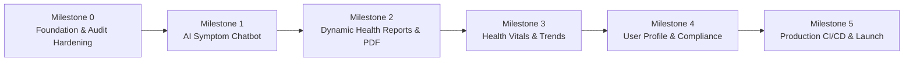

# Health Companion AI — Startup Development Roadmap & Milestones

**Mission:** Build a production-grade, patient-friendly AI Health & Wellness Companion that solves real-world health awareness challenges through conversational AI, structured risk assessments, and actionable lifestyle intelligence.

---

## Roadmap Overview

---

## Milestone 0: Foundation Hardening, Debugging & Delivery Readiness
> **Goal:** Ensure the current codebase is 100% bug-free, fully responsive, cleanly tested, and ready for high-velocity feature development.

- [ ] **0.1 UX & Navigation Consistency:**
  - Verify all CTAs across Landing Page (`Header`, `Hero`, `Features`, `Footer`) route dynamically based on auth state (direct to `/assessment` or `/dashboard` if logged in, `/auth` if guest).
  - Polish mobile drawer/navbar toggle and responsive layout on all screen sizes.
- [ ] **0.2 Robust Error Handling & Boundaries:**
  - Implement a global React Error Boundary with fallback UI so the app never shows a blank white screen on unexpected errors.
  - Implement network retry and user-friendly toast notifications for Supabase connection hiccups.
- [ ] **0.3 Automated Testing Foundation:**
  - Set up Vitest and React Testing Library.
  - Add unit tests for core utilities (`calculateBMI`, risk indicator logic, auth state helpers).
- [ ] **0.4 Code Cleanliness & Production Verification:**
  - Clean build output, verify strict TypeScript checks (`tsc --noEmit`), zero ESLint warnings/errors.
  - Commit milestone completion to GitHub with a clean semantic tag.

---

## Milestone 1: Interactive AI Symptom Consultation Chatbot
> **Goal:** Empower users to chat naturally about their symptoms, concerns, and health questions, receiving empathetic, safe, and structured AI guidance.

- [ ] **1.1 Chatbot Interface & Experience:**
  - Full-screen / drawer conversational interface with smooth micro-animations.
  - Typing indicator, quick-reply suggestion chips (e.g., "Frequent headaches", "Sleep issues", "Digestive problems").
  - Persistent chat history per user saved in Supabase.
- [ ] **1.2 Conversational AI Engine (Gemini / OpenAI Integration):**
  - Multi-turn conversation maintaining contextual symptom discovery.
  - Guardrails & Safety Filters: Emergency detection (e.g. chest pain, stroke symptoms triggers immediate emergency warning + 911/emergency dispatch advice).
  - Categorical risk determination (Low / Medium / High).
- [ ] **1.3 Automated Consultation Report Generation:**
  - AI extracts reported symptoms, duration, intensity, and lifestyle factors from the chat.
  - Synthesizes a structured "Health Assessment Summary" ready for review or export.
- [ ] **1.4 Direct Database Sync:**
  - Automatically saves the synthesized assessment into the user's Supabase dashboard.

---

## Milestone 2: Dynamic Health Reports & PDF Export
> **Goal:** Provide patients and doctors with beautifully formatted, professional health summaries they can view, print, download, or share.

- [x] **2.1 Standardized Report Template:**
  - Patient demographics (age, gender, BMI).
  - Chief complaints / symptoms timeline.
  - Lifestyle factors (sleep, hydration, activity score).
  - Categorical Risk Assessment with clear disclaimers.
  - Doctor discussion points (suggested questions the patient can ask their physician).
- [x] **2.2 High-Fidelity PDF Generator:**
  - Client-side vector PDF (`pdf-lib`) with clean typography, branded headers, page numbers, selectable text, and QR code verification (`qrcode`).
- [x] **2.3 Secure Shareable Links:**
  - Temporary read-only access link with expiration (24h, 3d, 7d), token hashing (SHA-256), immutable snapshots, and privacy toggles.

---

## Milestone 3: Health Vitals Analytics & Longitudinal Tracking
> **Goal:** Transform single-use assessments into a continuous health journey with trend tracking and habit adherence.

- [ ] **3.1 Visual Trend Charts (`Recharts`):**
  - BMI history progression graph over weeks/months.
  - Sleep duration vs. reported fatigue correlation.
  - Hydration and physical activity tracking.
- [ ] **3.2 Daily Habit & Wellness Check-in:**
  - 30-second daily check-in (mood, sleep hours, water intake, daily energy score).
  - Streak tracking and milestone achievements.

---

## Milestone 4: Patient Profile, Personalization & Privacy Readiness
> **Goal:** Medical history context, profile customization, and healthcare data privacy standards.

- [ ] **4.1 Comprehensive Health Profile:**
  - Known allergies, chronic conditions, family history, and current medications (for AI context only).
- [ ] **4.2 Data Privacy & Security (HIPAA/GDPR Alignment):**
  - "Download My Data" full JSON/PDF export.
  - Complete account & data deletion button (with Supabase CASCADE cleanup).
  - Granular privacy toggles for AI inference consent.

---

## Milestone 5: Production CI/CD, Deployment & Startup Launch
> **Goal:** Deploy to global edge CDN with automated testing, error tracking, and custom domain setup.

- [ ] **5.1 Automated CI/CD Pipeline:**
  - GitHub Actions workflow running lint, typecheck, and unit tests on every pull request and push to `main`.
- [ ] **5.2 Edge Production Hosting:**
  - Deployment on Vercel or Cloudflare Pages with custom domain configuration.
- [ ] **5.3 Monitoring & Observability:**
  - Sentry error monitoring integration.
  - Web Vitals performance tracking.
- [ ] **5.4 Launch Readiness & Marketing Landing:**
  - SEO optimization (dynamic OpenGraph cards, schema.org medical structured data, sitemap.xml).
